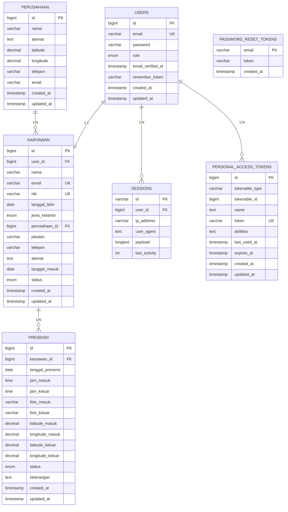
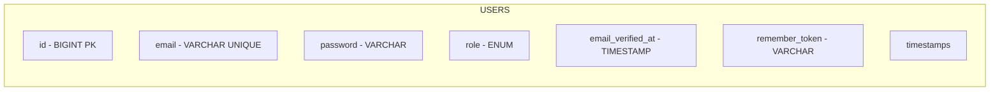
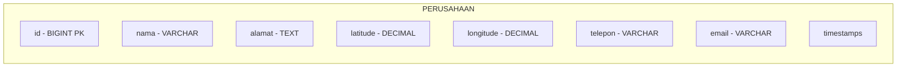
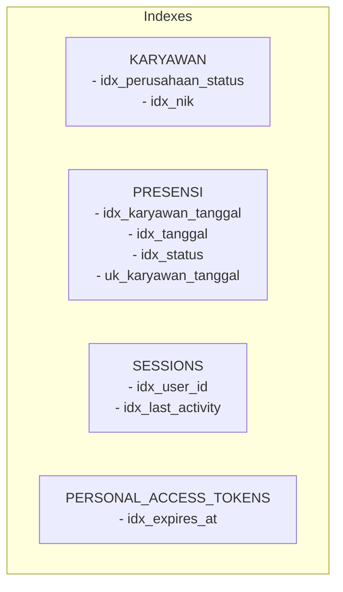
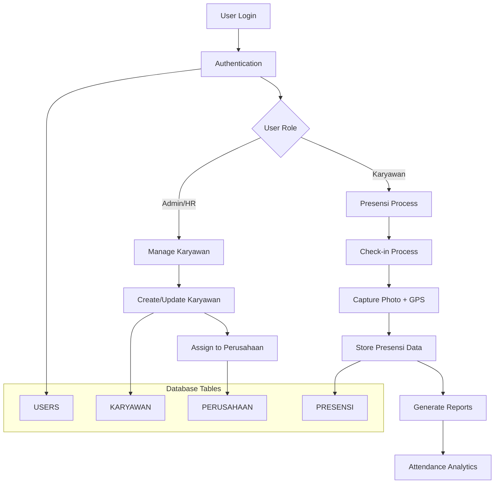

# PDM (Physical Data Model) - Sistem Presensi Karyawan

## Entity Relationship Diagram



## Database Schema Overview

```mermaid
graph TB
    subgraph "Authentication Layer"
        A[USERS<br/>- id (PK)<br/>- email<br/>- password<br/>- role]
        B[SESSIONS<br/>- id (PK)<br/>- user_id (FK)<br/>- payload]
        C[PASSWORD_RESET_TOKENS<br/>- email (PK)<br/>- token]
        D[PERSONAL_ACCESS_TOKENS<br/>- id (PK)<br/>- tokenable_id<br/>- token]
    end

    subgraph "Business Layer"
        E[PERUSAHAAN<br/>- id (PK)<br/>- nama<br/>- alamat<br/>- latitude/longitude]
        F[KARYAWAN<br/>- id (PK)<br/>- user_id (FK)<br/>- perusahaan_id (FK)<br/>- nama, nik, email<br/>- status]
    end

    subgraph "Transaction Layer"
        G[PRESENSI<br/>- id (PK)<br/>- karyawan_id (FK)<br/>- tanggal_presensi<br/>- jam_masuk/keluar<br/>- foto, GPS coordinates<br/>- status]
    end

    %% Relationships
    A -->|1:1| F
    E -->|1:N| F
    F -->|1:N| G
    A -->|1:N| B
    A -->|1:N| D
```

## Table Structure Details

### 1. USERS Table



### 2. PERUSAHAAN Table



### 3. KARYAWAN Table

```mermaid
graph LR
    subgraph "KARYAWAN"
        K1[id - BIGINT PK]
        K2[user_id - BIGINT FK]
        K3[nama - VARCHAR]
        K4[email - VARCHAR UNIQUE]
        K5[nik - VARCHAR UNIQUE]
        K6[tanggal_lahir - DATE]
        K7[jenis_kelamin - ENUM]
        K8[perusahaan_id - BIGINT FK]
        K9[jabatan - VARCHAR]
        K10[telepon - VARCHAR]
        K11[alamat - TEXT]
        K12[tanggal_masuk - DATE]
        K13[status - ENUM]
        K14[timestamps]
    end
```



### 4. PRESENSI Table

```mermaid
graph LR
    subgraph "PRESENSI"
        PR1[id - BIGINT PK]
        PR2[karyawan_id - BIGINT FK]
        PR3[tanggal_presensi - DATE]
        PR4[jam_masuk - TIME]
        PR5[jam_keluar - TIME]
        PR6[foto_masuk - VARCHAR]
        PR7[foto_keluar - VARCHAR]
        PR8[latitude_masuk - DECIMAL]
        PR9[longitude_masuk - DECIMAL]
        PR10[latitude_keluar - DECIMAL]
        PR11[longitude_keluar - DECIMAL]
        PR12[status - ENUM]
        PR13[keterangan - TEXT]
        PR14[timestamps]
    end
```



## Index Strategy



## Data Flow Diagram



## Key Features Highlighted

### 🔐 Security Features

-   Role-based access control (admin, karyawan, hr)
-   JWT token authentication
-   Password reset functionality
-   Session management

### 📊 Business Logic

-   Employee status tracking
-   Attendance status management
-   GPS location verification
-   Photo capture for verification

### ⚡ Performance Features

-   Strategic indexing
-   Foreign key constraints
-   Unique constraints
-   Cascade delete operations

### 📱 Mobile-Ready Features

-   GPS coordinate storage
-   Photo upload support
-   Real-time status tracking
-   Offline capability support

