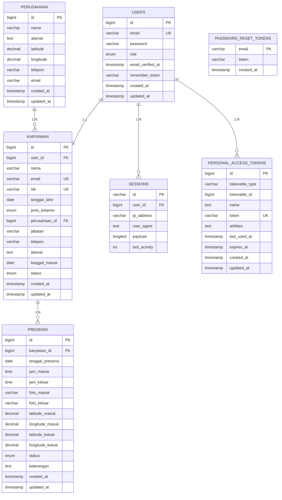
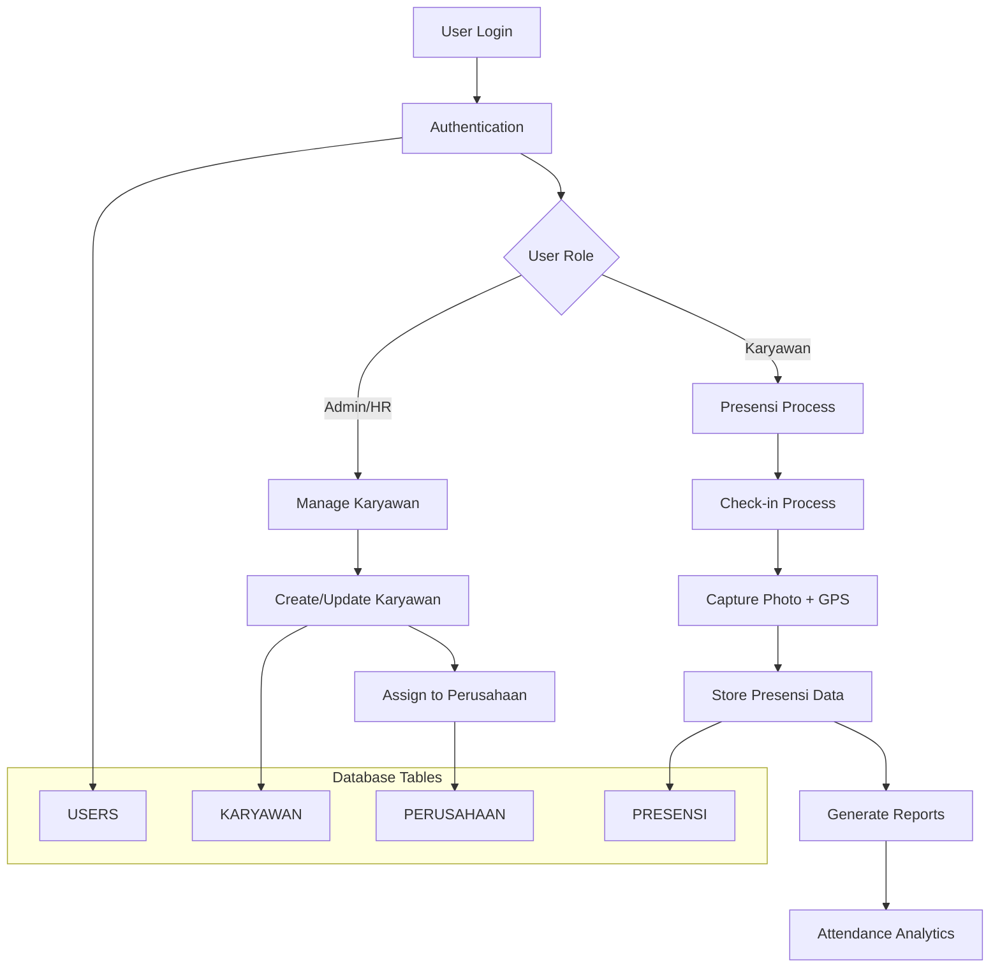

# Database PDM Diagram

## Entity Relationship Diagram



## Database Schema Overview

```mermaid
graph TB
    subgraph "Authentication Layer"
        A[USERS<br/>- id (PK)<br/>- email<br/>- password<br/>- role]
        B[SESSIONS<br/>- id (PK)<br/>- user_id (FK)<br/>- payload]
        C[PASSWORD_RESET_TOKENS<br/>- email (PK)<br/>- token]
        D[PERSONAL_ACCESS_TOKENS<br/>- id (PK)<br/>- tokenable_id<br/>- token]
    end

    subgraph "Business Layer"
        E[PERUSAHAAN<br/>- id (PK)<br/>- nama<br/>- alamat<br/>- latitude/longitude]
        F[KARYAWAN<br/>- id (PK)<br/>- user_id (FK)<br/>- perusahaan_id (FK)<br/>- nama, nik, email<br/>- status]
    end

    subgraph "Transaction Layer"
        G[PRESENSI<br/>- id (PK)<br/>- karyawan_id (FK)<br/>- tanggal_presensi<br/>- jam_masuk/keluar<br/>- foto, GPS coordinates<br/>- status]
    end

    %% Relationships
    A -->|1:1| F
    E -->|1:N| F
    F -->|1:N| G
    A -->|1:N| B
    A -->|1:N| D
```

## Data Flow Diagram




